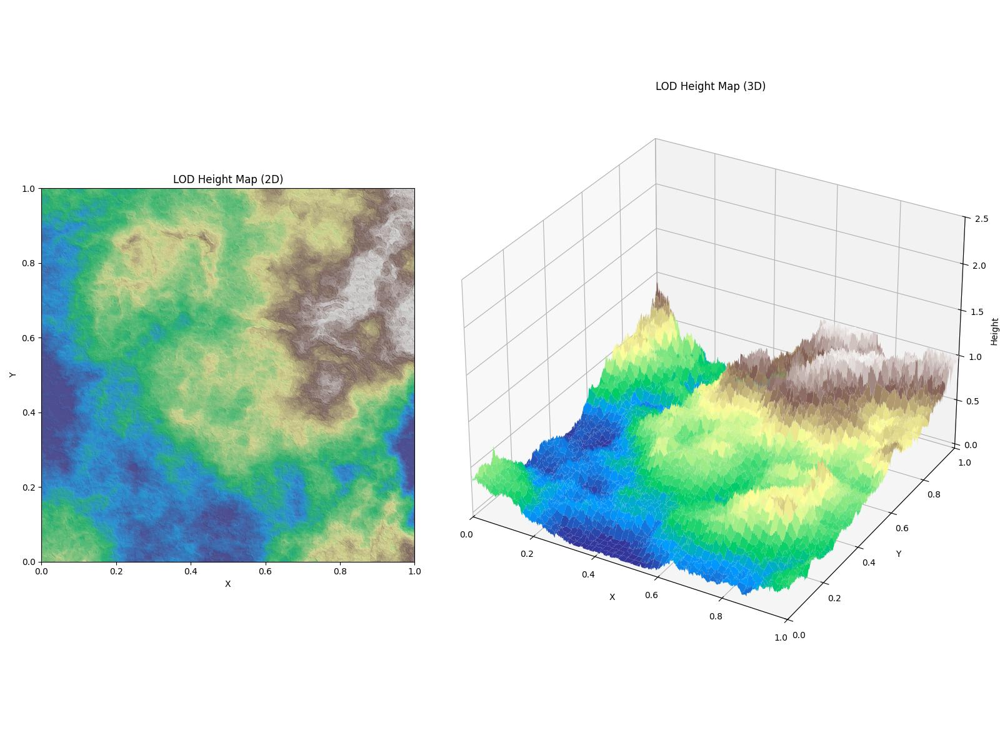
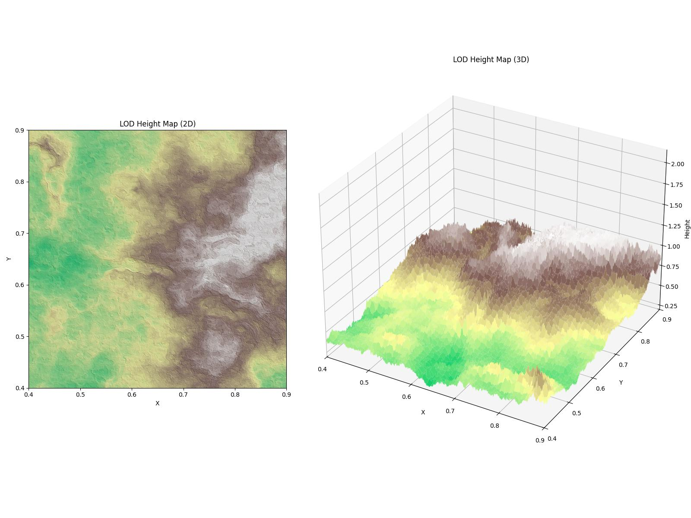
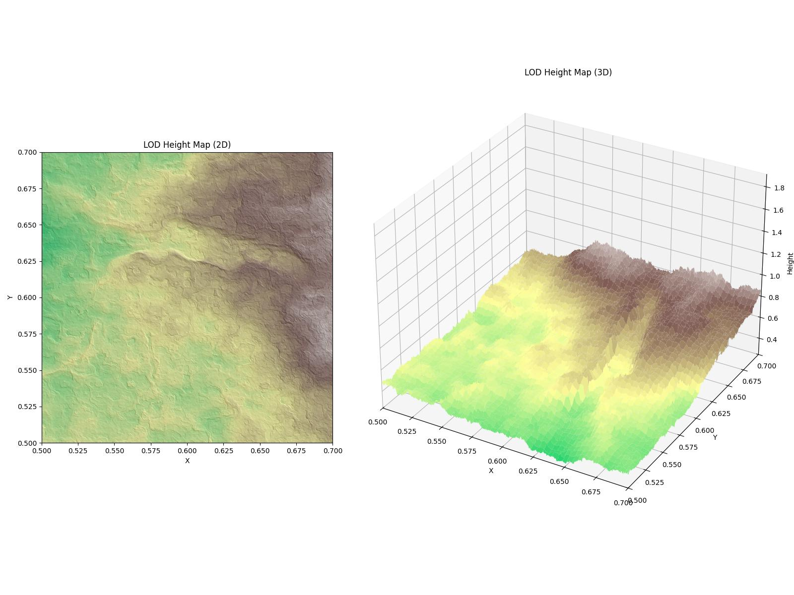
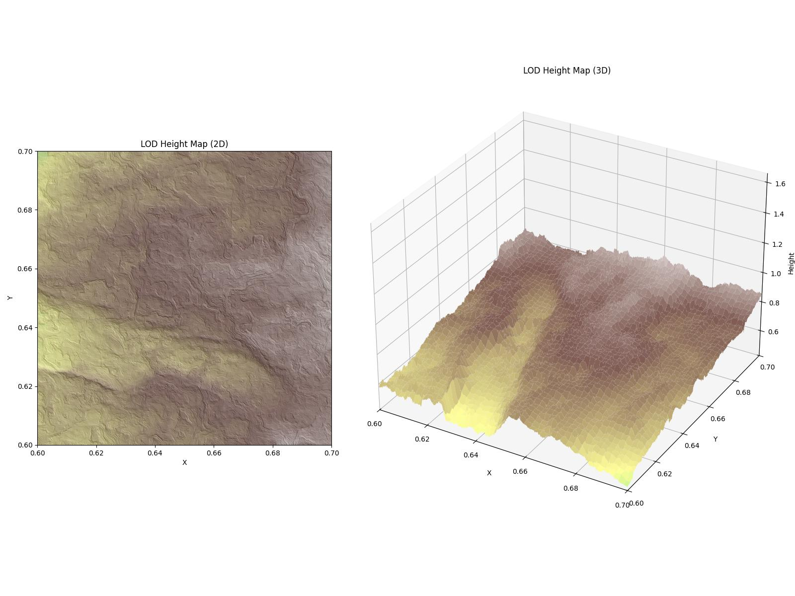
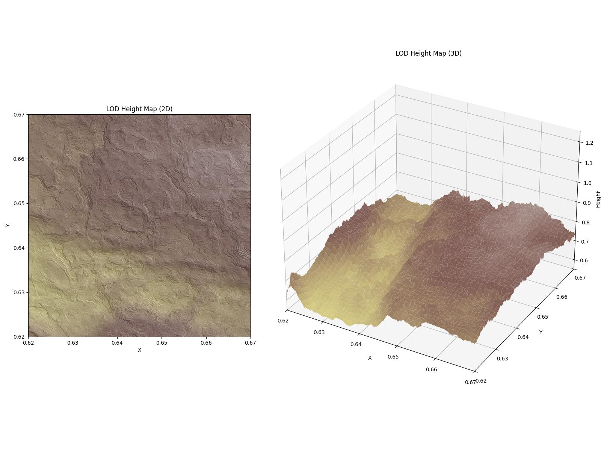
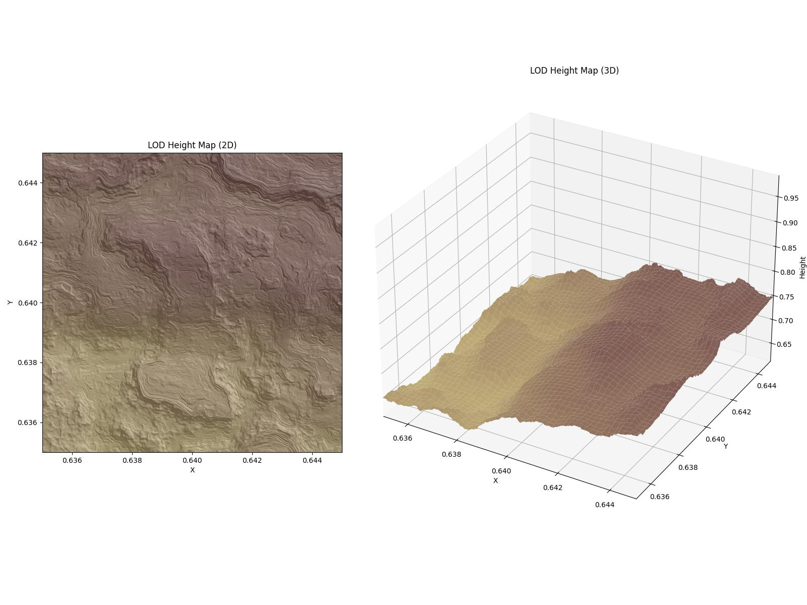

# Infinite Terrain Generator

This project focuses on generating realistic terrains with infinite resolution using Python. By leveraging Numba, the generator achieves high computational efficiency, enabling detailed exploration from large-scale continents to small valleys.

---

## Gallery: Zooming In

The following images demonstrate the generator's capability to produce terrains at varying levels of detail. Each image represents the same world, progressively zoomed in:

| Level | Resolution | Asset |
|-------|----------------:|-------|
| 1 - World | 100 km |  |
| 2 - Continent | 50 km |  |
| 3 - Region | 20 km |  |
| 4 - Area | 10 km |  |
| 5 - Valley | 5 km |  |
| 6 - Hill | 5 km |  |

---

## Features

- **Infinite terrains**: Generate heightmaps at any zoom level.
- **Realistic erosion**: Simulate thermal and hydraulic erosion for natural-looking landscapes.
- **Customizable**: Adjust parameters to create diverse and unique terrains.
- **Visualization tools**: Preview terrains in both 2D and 3D.
- **Optimized performance**: Critical computations are accelerated using Numba.

---

## Getting Started

### Installation

```bash
git clone https://github.com/your-username/infinite-terrain-generator.git
cd infinite-terrain-generator
pip install numpy scipy matplotlib numba
```

### Usage

```python
from terrain_lod import Terrain

# Create a terrain instance
t = Terrain(seed=42, erode=True)

# Generate a heightmap
t.plot(lim=(0.0, 1.0, 0.0, 1.0), zlim=(0, 3), save_path="world.png")
```

For additional examples, refer to [`example.ipynb`](example.ipynb).

---

## Project Structure

```
map_maker/
├── terrain_lod/
│   ├── terrain.py       # Core terrain generation logic
│   ├── erosion.py       # Erosion simulation algorithms
│   ├── noise.py         # Noise generation functions
│   └── helper.py        # Supporting utilities
├── assets/              # Sample images
├── example.ipynb        # Interactive notebook
└── README.md
```

---

## License

This project is licensed under the MIT License. You are free to use and modify it as needed.
